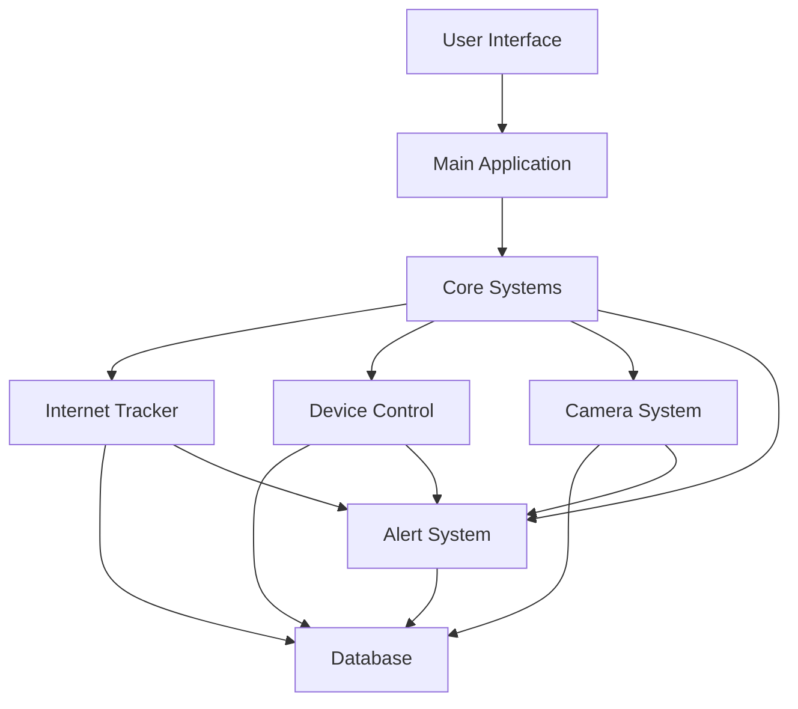

# Complete Internet Usage and Security Monitor - Architecture Overview

## 1. Project Structure
```
smart_monitor/
├── core/
│   ├── __init__.py
│   ├── internet_tracker/
│   │   ├── __init__.py
│   │   ├── tracker.py
│   │   └── website_monitor.py
│   ├── device_control/
│   │   ├── __init__.py
│   │   ├── controller.py
│   │   └── network_manager.py
│   ├── camera_system/
│   │   ├── __init__.py
│   │   ├── blink_controller.py
│   │   ├── video_processor.py
│   │   └── motion_detector.py
│   └── alert_system/
│       ├── __init__.py
│       ├── alert_manager.py
│       └── notification_sender.py
├── database/
│   ├── __init__.py
│   ├── models.py
│   └── database_manager.py
├── ui/
│   ├── __init__.py
│   ├── main_window.py
│   ├── internet_tab.py
│   ├── devices_tab.py
│   ├── camera_tab.py
│   └── alerts_tab.py
├── utils/
│   ├── __init__.py
│   ├── network_utils.py
│   ├── security_utils.py
│   └── logging_utils.py
├── config/
│   ├── __init__.py
│   ├── settings.py
│   └── constants.py
├── main.py
└── requirements.txt
```

## 2. Database Schema

```sql
-- Core Tables
CREATE TABLE users (
    id INTEGER PRIMARY KEY,
    username TEXT UNIQUE,
    password_hash TEXT,
    role TEXT
);

CREATE TABLE children (
    id INTEGER PRIMARY KEY,
    name TEXT,
    age INTEGER,
    daily_limit INTEGER,
    parent_id INTEGER,
    FOREIGN KEY(parent_id) REFERENCES users(id)
);

-- Device Management
CREATE TABLE devices (
    id INTEGER PRIMARY KEY,
    name TEXT,
    mac_address TEXT UNIQUE,
    ip_address TEXT,
    device_type TEXT,
    child_id INTEGER,
    status TEXT,
    FOREIGN KEY(child_id) REFERENCES children(id)
);

-- Internet Usage
CREATE TABLE internet_usage (
    id INTEGER PRIMARY KEY,
    device_id INTEGER,
    start_time DATETIME,
    end_time DATETIME,
    bytes_sent INTEGER,
    bytes_received INTEGER,
    FOREIGN KEY(device_id) REFERENCES devices(id)
);

-- Website Tracking
CREATE TABLE website_access (
    id INTEGER PRIMARY KEY,
    device_id INTEGER,
    url TEXT,
    access_time DATETIME,
    duration INTEGER,
    category TEXT,
    FOREIGN KEY(device_id) REFERENCES devices(id)
);

-- Camera System
CREATE TABLE cameras (
    id INTEGER PRIMARY KEY,
    name TEXT,
    location TEXT,
    type TEXT,
    status TEXT
);

CREATE TABLE recordings (
    id INTEGER PRIMARY KEY,
    camera_id INTEGER,
    start_time DATETIME,
    duration INTEGER,
    file_path TEXT,
    trigger_type TEXT,
    FOREIGN KEY(camera_id) REFERENCES cameras(id)
);

CREATE TABLE motion_events (
    id INTEGER PRIMARY KEY,
    camera_id INTEGER,
    timestamp DATETIME,
    snapshot_path TEXT,
    recording_id INTEGER,
    FOREIGN KEY(camera_id) REFERENCES cameras(id),
    FOREIGN KEY(recording_id) REFERENCES recordings(id)
);

-- Alert System
CREATE TABLE alert_config (
    id INTEGER PRIMARY KEY,
    name TEXT,
    type TEXT,
    threshold REAL,
    notification_method TEXT,
    enabled BOOLEAN
);

CREATE TABLE alert_history (
    id INTEGER PRIMARY KEY,
    config_id INTEGER,
    timestamp DATETIME,
    message TEXT,
    acknowledged BOOLEAN,
    FOREIGN KEY(config_id) REFERENCES alert_config(id)
);
```

## 3. Core Components

### 3.1 Internet Usage Tracker
- Monitors network traffic
- Tracks website access
- Enforces usage limits
- Manages website filtering

### 3.2 Device Control System
- Manages device registration
- Controls network access
- Implements bandwidth limiting
- Handles device shutdown/startup

### 3.3 Camera System
- Manages Blink cameras
- Handles video recording
- Processes motion detection
- Manages video storage

### 3.4 Alert System
- Monitors thresholds
- Sends notifications
- Logs events
- Manages alert rules

## 4. Integration Flow



## 5. Class Structure

### 5.1 Main Application
```python
class MainApplication:
    def __init__(self):
        self.db = DatabaseManager()
        self.internet_tracker = InternetTracker()
        self.device_control = DeviceController()
        self.camera_system = CameraSystem()
        self.alert_system = AlertSystem()
        self.ui = MainWindow()
```

### 5.2 Core Systems
```python
class InternetTracker:
    def __init__(self):
        self.website_monitor = WebsiteMonitor()
        self.usage_tracker = UsageTracker()

class DeviceController:
    def __init__(self):
        self.network_manager = NetworkManager()
        self.device_monitor = DeviceMonitor()

class CameraSystem:
    def __init__(self):
        self.blink_controller = BlinkController()
        self.motion_detector = MotionDetector()
        self.video_processor = VideoProcessor()

class AlertSystem:
    def __init__(self):
        self.alert_manager = AlertManager()
        self.notification_sender = NotificationSender()
```

## 6. Communication Flow

### 6.1 Event System
```python
class EventSystem:
    def __init__(self):
        self.subscribers = defaultdict(list)

    def subscribe(self, event_type, callback):
        self.subscribers[event_type].append(callback)

    def publish(self, event_type, data):
        for callback in self.subscribers[event_type]:
            callback(data)
```

### 6.2 Event Types
```python
EVENT_TYPES = {
    'INTERNET_LIMIT_EXCEEDED',
    'DEVICE_OFFLINE',
    'MOTION_DETECTED',
    'ALERT_TRIGGERED',
    'RECORDING_COMPLETE',
    'WEBSITE_BLOCKED',
    'DEVICE_SHUTDOWN'
}
```

## 7. Configuration

```python
# config/settings.py
DEFAULT_CONFIG = {
    'database': {
        'path': 'monitor.db',
        'backup_interval': 86400
    },
    'internet': {
        'check_interval': 60,
        'batch_size': 100
    },
    'camera': {
        'storage_path': 'recordings/',
        'retention_days': 30,
        'motion_sensitivity': 0.3
    },
    'alerts': {
        'email_server': 'smtp.gmail.com',
        'email_port': 587,
        'notification_cooldown': 300
    }
}
```

## 8. Security Features

### 8.1 Authentication
- User authentication system
- Role-based access control
- Secure password storage

### 8.2 Network Security
- Encrypted communications
- Secure device control
- Protected camera access

## 9. Thread Management

```python
class ThreadManager:
    def __init__(self):
        self.threads = {}
        self.active = True

    def start_thread(self, name, target):
        thread = threading.Thread(
            target=target,
            name=name,
            daemon=True
        )
        self.threads[name] = thread
        thread.start()

    def stop_all(self):
        self.active = False
        for thread in self.threads.values():
            thread.join()
```

## 10. Error Handling

```python
class ErrorHandler:
    def __init__(self):
        self.logger = logging.getLogger('monitor')

    def handle_error(self, error, context):
        self.logger.error(f"Error in {context}: {str(error)}")
        self.notify_admin(error, context)

    def notify_admin(self, error, context):
        # Send notification to admin
        pass
```

Would you like me to elaborate on any specific component or provide more detailed implementation examples?

Key areas for potential elaboration:
1. Specific component implementations
2. Database interactions
3. User interface details
4. Security implementations
5. Thread management
6. Error handling strategies
